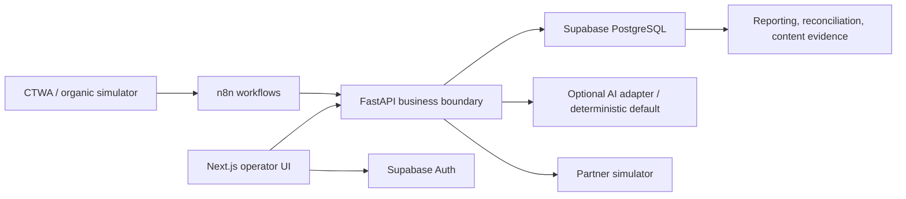

# Nueva Ruta Ops

Nueva Ruta Ops is a Spanish-first operations prototype for fictional debt-management lead intake. It demonstrates traceable creator attribution, redacted lead triage, human-reviewed responses, controlled partner handoff, dirty-data reconciliation, operational reporting, and evidence-linked content planning. All fixtures and partner activity are synthetic; this is not a consumer financial service or production system.

## Product walkthrough



- Operators process leads, review drafts, resolve escalations, record dispositions, and prepare partner handoffs.
- Supervisors publish versioned rules, approve transfers and review actions, manage recovery, and reset synthetic demo state.
- Analysts see attribution-safe reporting and reconciliation evidence.
- No substantive message or partner transfer bypasses human authorization.

## Start locally

Requires Docker with Compose v2, Node.js `24.18.0` / pnpm `11.17.0`, Python `3.12.12` / uv `0.12.0`, `curl`, and a POSIX shell. The local path has no paid-service requirement.

```bash
cp .env.example .env
# Replace every local placeholder with unique local-only values.
pnpm install --frozen-lockfile
uv sync --frozen
make up
make verify
```

Keep AI set to `deterministic` for a no-provider demo. Never paste real lead information or reuse credentials. `make up` initializes local Supabase Auth/Postgres, bootstraps the three synthetic roles, builds the application containers, and waits for service health.

| Command | Purpose |
| --- | --- |
| `make up` / `make down` | Start or stop the local Compose + Supabase stack |
| `make verify` | Check web, API, n8n, simulator, UI→API, and authenticated SSR smoke paths |
| `make reset` | Reapply local migrations/seeds and bootstrap synthetic identities |
| `make test-db` | Run Supabase database integration tests |
| `pnpm --filter @nueva-ruta/web test:e2e` | Run authenticated Chromium case-flow tests against the running local stack |
| `make quality` | Format, lint, typecheck, Python/UI tests, and repository-boundary checks |
| `pnpm --dir apps/web build` | Build the Next.js application |

Local URLs: web <http://localhost:3000>, API docs <http://localhost:8000/docs>, n8n <http://localhost:5678>, simulator docs <http://localhost:8081/docs>, Supabase Studio <http://localhost:54323>.

## Data and safety boundaries

- All records are fictional. Seeded demo roles use passwords supplied in ignored `.env`; do not commit or share them publicly.
- Next.js and n8n use authenticated FastAPI contracts for business data. Supabase is accessed directly by the web layer only for its server-managed auth session.
- Supabase SQL migrations are the only schema history. `make reset` is for local developer setup; the product reset is supervisor-gated and audited.
- AI is optional. Deterministic processing is the no-key, reproducible default. Any optional model receives redacted text and can only assist with reviewed drafts; it cannot decide real suitability, publish, or transfer.
- This prototype is not approved for real consumers, real financial intake, real partner connectivity, or production traffic.

## Temporary hosted demo

WI-009 defines a short-lived, authenticated synthetic demo on Railway + Supabase Cloud, approved up to USD 7 total and expiring **2026-10-09 at 23:59 America/Bogota**. It remains conditional on a verifiable cost path within that cap. Only the web UI may be public; API, n8n, and simulator remain private. No live AI or real lead data is used. The local stack remains authoritative. See [temporary demo operations](docs/09_TEMPORARY_DEMO.md).

## Documentation

- [Architecture and operations](docs/07_ARCHITECTURE_OPERATIONS.md)
- [Compliance and AI boundary](docs/planning/06_COMPLIANCE_AND_AI.md) · [AI-use guide](docs/08_AI_USE.md)
- [Partner data cleaning and reconciliation](docs/10_PARTNER_DATA_CLEANING.md)
- [Synthetic load method and report](docs/11_SCALE_REPORT.md)
- [Product and requirements index](docs/planning/00_INDEX.md) · [work items](docs/planning/08_WORK_ITEMS.md) · [decision log](docs/planning/07_DECISIONS.md)
- [Implementation verification reports](docs/implementation/)
- [n8n workflow export/import notes](infra/n8n/workflows/README.md)

## Current scope

Implemented WI-001–WI-008 cover local runtime and auth, deterministic synthetic domain data, governed rules, lead ingestion and drafts, CRM dispositions and partner delivery recovery, partner import and reconciliation, reporting, and creator content planning. WI-009 is release hardening and temporary-demo readiness—not another customer-facing workflow. Hosted availability and measured results are recorded only after they are verified.
