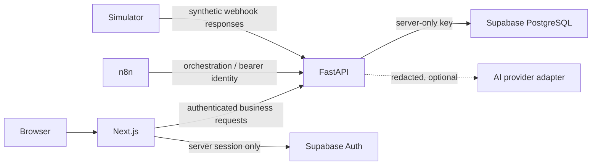

# Architecture and Operations

## Product boundary

Nueva Ruta Ops is a synthetic operations prototype. It models marketing intake, minimum pre-qualification, human-reviewed communication, simulated partner handoff, import cleaning, reconciliation, reporting and content planning. It does not perform detailed financial intake or determine real debt-management suitability.

## Runtime boundaries



- FastAPI is the business read/write and authorization boundary. n8n orchestrates; it is not domain truth.
- Supabase Auth handles identity, PostgreSQL persists business state, and tracked Supabase SQL migrations are the sole schema history.
- The web app's direct Supabase use is limited to server-side auth/session handling.
- Transactional outbox and idempotency remain in Postgres. Redis is intentionally absent until measurements justify it.
- The simulator is fictional and not connected to consumer channels or a real partner.

## Local lifecycle

Prerequisites and the supported one-path startup are in the [README](../README.md). `scripts/local.sh` starts Supabase first, writes only generated local keys into ignored `.env.runtime`, bootstraps synthetic roles, builds Compose, and waits for service health. The Compose services are `web`, `api`, `n8n`, and `simulator`; the Supabase CLI owns local Postgres/Auth/Studio. `make verify` checks readiness, web-to-API reachability, and an authenticated server-rendered session.

Useful recovery commands:

```bash
make down
make up
make verify
make test-db
make reset
```

`make reset` is a local destructive database rebuild. The product reset is a separate supervisor-authorized command with exact confirmation, reason, correlation ID, and an audit event. Never run a local reset against a hosted project.

## Logging and readiness

API and simulator emit one JSON request record with correlation ID, method, route template, status and elapsed milliseconds. They do not log query strings, request bodies, auth headers, or raw path identifiers. Invalid `X-Correlation-ID` values are replaced; accepted IDs contain only 1–100 alphanumeric, dot, underscore, colon or hyphen characters. Responses return the correlation ID. n8n exports include execution branching and pass explicit correlation values into API contracts; inspect n8n execution details only with synthetic fixtures.

`/health/live` indicates process liveness. `/health/ready` checks the API's Supabase Auth dependency; readiness endpoints expose dependency state, not credentials. Simulator readiness is process-level because it has no persistent dependency. Container healthchecks use these routes, and the web has `/api/health` plus an authenticated smoke route for release verification.

## Temporary hosted topology

WI-009 permits a temporary, synthetic Railway + Supabase Cloud demonstration only, under [ADR-025](planning/07_DECISIONS.md#adr-025--temporary-hosted-demo-ceiling-and-expiry). Public traffic terminates at the authenticated web UI. API, n8n and simulator use private service networking; Supabase is accessed by the app, not exposed through a Railway public database port. Hosted secrets live in managed variables and never in Git, build arguments, n8n JSON or logs. 

## Known limitations

- A developer workstation's local load measurement is not a cloud capacity test or SLA.
- Request logs are intentionally minimal and should be joined via correlation IDs to safe application/database evidence, not expanded with user content.
- The synthetic roles and passwords are demo fixtures, not a production identity lifecycle.
- This prototype has not undergone production security certification or legal review.
