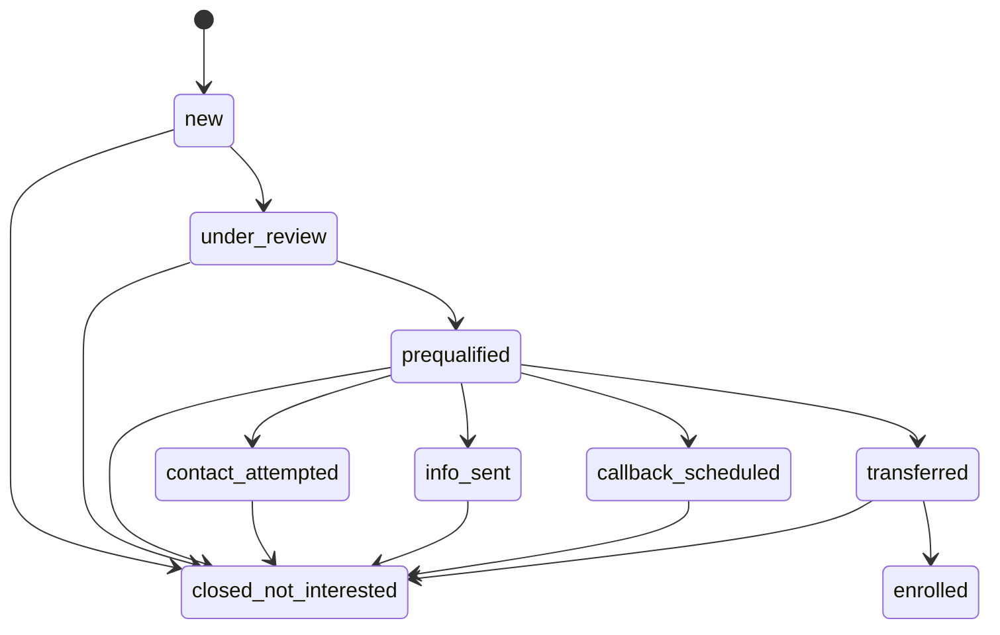
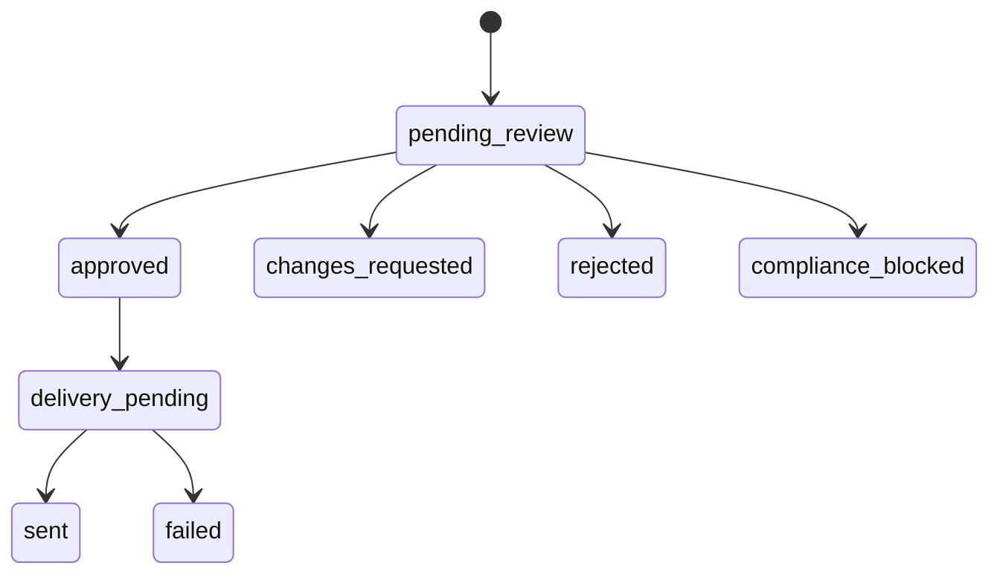
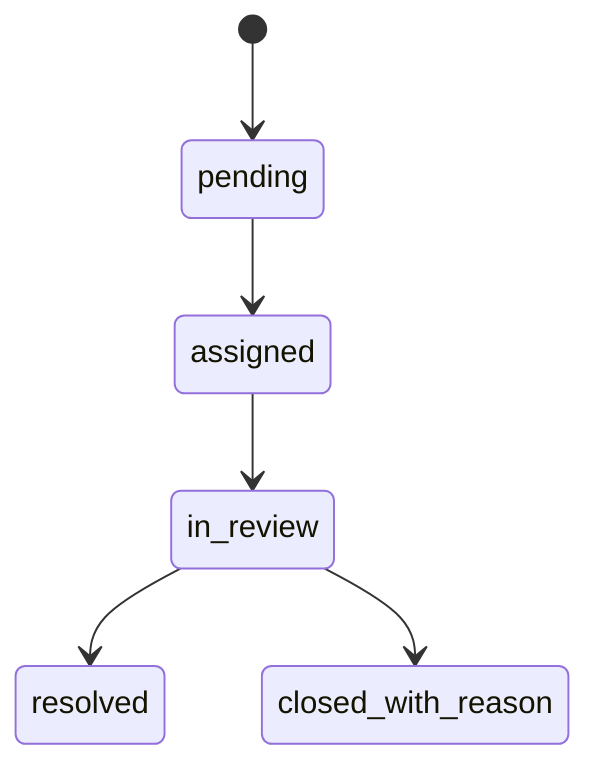
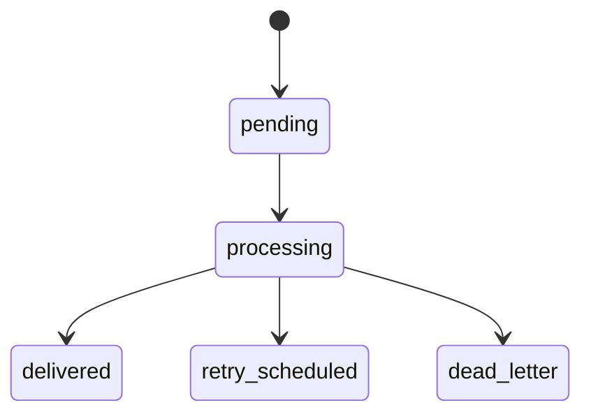
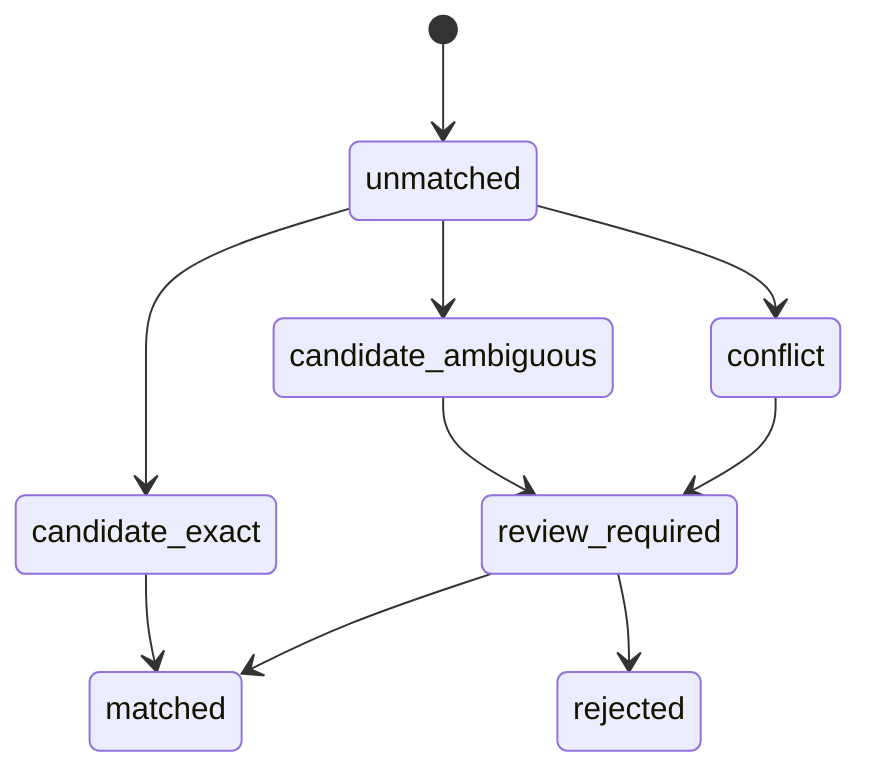

# Domain and Workflows — Nueva Ruta Ops

Status: approved by human (2/10/2026 12:56 p.m. COL)

## Domain boundaries

### Acquisition

Owns creators, tracking parameters, channel/source detail and the original attribution attached to a lead.

### Lead operations

Owns inbound messages, consent context, classification, pre-qualification fields, drafts, dispositions, commercial stage and escalations.

### Partner delivery

Owns approved transfer requests, simulated partner responses, retry attempts, terminal failures and partner case IDs.

### Partner data

Owns imported enrollment rows, normalization, canonical partner records, reconciliation evidence and review decisions.

### Reporting

Derives funnel, SLA, stalled work, error and attribution metrics without mutating operational facts.

### Content planning

Owns fictional sources, prioritization evidence, scripts and review versions. It does not publish content.

## Independent state models

### Commercial lead stage

`escalated` is not a commercial stage. A lead can remain `prequalified` while a compliance task is `in_review`.

### Draft state

### Escalation state

### Delivery state

### Reconciliation state

## WF-01 — Inbound lead

1. Simulator sends a source event ID, timestamp, channel, source details, message and fictional phone.
2. n8n receives the event and forwards it to the ingestion API.
3. API validates shape and checks idempotency.
4. Original values and consent context are persisted.
5. Sensitive patterns are detected and redacted for downstream views.
6. If permitted, the fixed receipt/privacy acknowledgement is placed in the outbox.
7. Active rules evaluate explicit opt-out, spam, sensitive data and handoff triggers.
8. Optional AI extracts structured fields and proposes a summary/draft.
9. Schema and compliance validators check the output.
10. The system records `respond`, `ignore` or `escalate_human` with evidence.
11. `respond` creates a substantive draft; it does not send it.

Exceptions:

- Duplicate event: return the original result without new effects.
- AI timeout: deterministic decisions continue; uncertain work escalates.
- SSN/account pattern: redact and create high-priority supervisor task.
- Opt-out: suppress ordinary messaging and send only fixed confirmation when allowed.

## WF-02 — Human draft review

1. Operator opens lead, redacted history, extracted fields, active rule evidence and draft.
2. Operator edits or requests changes.
3. Compliance validator runs on each approval attempt.
4. Blocked language prevents approval and creates/updates a supervisor task.
5. Approved content creates one idempotent delivery event.
6. Audit stores actor, prior text checksum, approved checksum and rule/template/model metadata.

No implementation in the demo needs to send to real WhatsApp; delivery is simulated and observable.

## WF-03 — Escalation

1. Trigger creates reason code, priority and due time from the published rule version.
2. Routing suggests operator, supervisor or analyst.
3. A user claims the task.
4. User reviews redacted context and evidence.
5. Resolution can create a draft, request more information, approve transfer eligibility, link reconciliation evidence or close with reason.
6. SLA events record assignment, breach and resolution.

Default fictional SLA:

| Reason | Owner | Due |
|---|---|---:|
| sensitive/high risk | supervisor | 15 minutes |
| compliance question | supervisor | 1 hour |
| ambiguity/coverage | operator | 4 business hours |
| attribution conflict | analyst | 2 business days |

## WF-04 — CRM disposition

1. Operator chooses one of five dispositions.
2. API validates current stage, required phone, callback time or approval evidence.
3. Transaction writes disposition, new stage, audit event and required outbox event.
4. n8n visualizes the side-effect path.
5. Delivery worker sends to the simulator or schedules retry.

Important behaviors:

- `No Answer` does not auto-send a substantive follow-up; it creates a draft.
- `Info Sent` requires an approved message or recorded manual action.
- `Transferido` requires a separate explicit transfer approval.
- `Call Back` requires a future time and timezone.
- `No le interesa` only sets opt-out when the lead explicitly revoked contact.

## WF-05 — Partner transfer

1. Operator approves transfer from an eligible review screen.
2. Transaction creates transfer record and outbox event.
3. n8n calls the simulated Consejería Clara webhook.
4. Success records partner request/case ID and delivery evidence.
5. Retryable failure follows configurable backoff.
6. Terminal failure enters DLQ with replay control.
7. Repeated command with the same key never creates a second partner case.

## WF-06 — Rule lifecycle

1. YAML seeds a reproducible initial rule set.
2. Supervisor creates a database draft from the active or earlier version.
3. UI validates schema, references, ranges and automatic template restrictions.
4. UI presents a diff.
5. Supervisor publishes an immutable version.
6. New decisions use it; historical decisions retain their original version.
7. Rollback publishes a new version derived from an earlier version.
8. Published content can be exported to YAML.

## WF-07 — Partner CSV and reconciliation

1. User imports a CSV; system stores file metadata and raw rows.
2. Normalization produces separate canonical values and quality issues.
3. Duplicates remain linked to every raw occurrence.
4. Matching attempts shared ID, then unique normalized phone plus compatible evidence.
5. Exact conflict-free candidate is marked matched.
6. Missing/contradictory creator, phone mismatch or multiple candidates create review cases.
7. Analyst accepts, rejects or links with a reason.
8. Reporting recomputes from reconciliation state without rewriting sources.

## WF-08 — Content planning

1. Operator/analyst reviews ten fictional questions, objections and trends.
2. Ranking exposes frequency, funnel proximity, freshness and compliance risk.
3. Three sources are selected for scripts.
4. AI may propose copy, but the script is a reviewable version.
5. Compliance controls require `consejero`, conditional savings and no invented figures.
6. Each script links back to its source and creator fit.

## Stalled-work defaults

These are editable business defaults, not external benchmarks:

| Condition | Threshold |
|---|---:|
| new lead unclassified | 15 minutes |
| human review pending | 4 business hours |
| prequalified without disposition | 8 business hours |
| Info Sent without activity | 24 hours |
| callback | at scheduled time |
| transferred without partner confirmation | 48 hours |
| reconciliation conflict unresolved | 2 business days |

The demo uses seeded timestamps so the evaluator can see on-time, approaching and breached items without waiting.

## Failure semantics

- Validation error: reject command; do not mutate stage.
- Retryable integration error: retain domain transaction and schedule retry.
- Terminal integration error: retain facts and create dead-letter work.
- Business ambiguity: escalation, never technical retry.
- Missing phone: human task, not a fake send.
- Unknown disposition: explicit error, never coerced to a known value.
- Conflicting attribution: reconciliation review, never first-match-wins.
